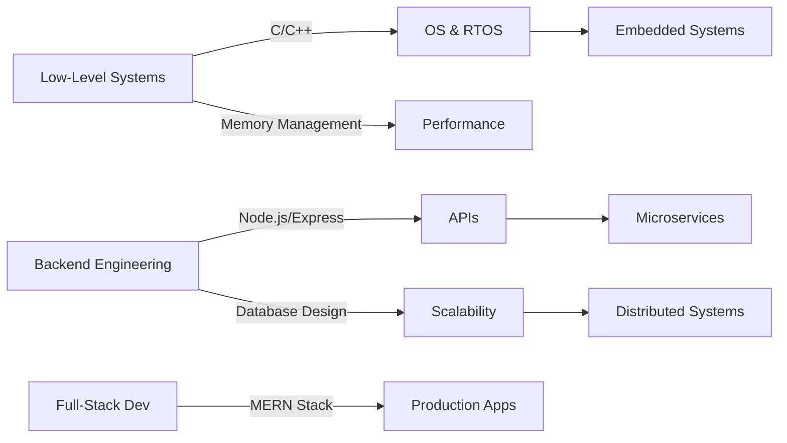

<div align="center">
  
</div>

<div align="center">
  


</div>

<div align="center">
  
  
  
</div>

---


### About Me:

**What I Build**  
Production-grade systems with emphasis on systems programming, backend architecture, and scalable solutions. Specializing in low-level C/C++ development, embedded systems (Zephyr RTOS), and high-performance backend services using Node.js/Express.

**Technical Expertise**  
- **Systems Programming**: Memory management, multithreading, OS fundamentals, and network protocols
- **Backend Development**: RESTful APIs, microservices architecture, database optimization, and API security
- **Full-Stack Engineering**: MERN stack development with focus on performance and scalability
- **Software Design**: Design patterns, clean architecture, SOLID principles, and code maintainability

**Open to Collaborate On**  
Open-source projects in distributed systems, backend infrastructure, developer tooling, CI/CD pipelines, performance-critical applications, and embedded software.

**Currently Advancing In**  
Distributed systems architecture, concurrent programming patterns, database internals, advanced algorithms, system design at scale, and cloud-native application development.

**Technical Discussions**  
Systems programming (C/C++), data structures & algorithms, operating systems internals, computer networks, TCP/IP protocols, backend scalability, database design, API architecture, software design patterns, and DevOps practices.

**Engineering Philosophy**  
Write clean, maintainable code. Optimize for readability first, then performance. Build systems that scale. Test thoroughly. Document extensively.

**Reach Me**: pandeyaanjaneya76@gmail.com

<br clear="both">

---

## Connect With Me:

<div align="center">
  
[](https://linkedin.com/in/aanjaneya-pandey-9715b2335)
[](https://instagram.com/aanjaneya_24)
[](mailto:pandeyaanjaneya76@gmail.com)
[](#)
[](#)
[](https://codeforces.com/profile/Aanjaneya24)

</div>


## Tech Stack:

<div align="center">

### Languages & Frameworks

 
 


### Frontend Development


### Backend & APIs


### Databases & Backend Services


### Cloud & Deployment


### AI/ML & Data Science


### DevOps & Tools


### Design Tools


### Hardware & IoT


</div>

---

## Engineering Expertise & Technical Focus

<div align="center">

### Systems Architecture & Design



</div>

### Technical Problem Solving

<div align="center">

| **Data Structures** | **Algorithms** | **System Design** | **Networking** |
|:---:|:---:|:---:|:---:|
| Trees, Graphs, Heaps | Dynamic Programming | Scalability Patterns | TCP/IP, HTTP/HTTPS |
| Hash Tables, Tries | Graph Algorithms | Load Balancing | WebSockets, REST |
| Linked Lists, Stacks | Sorting & Searching | Database Sharding | Network Protocols |
| Queues, Deques | Greedy, Backtracking | Caching Strategies | Socket Programming |

</div>

### Development Philosophy

<div align="center">

```
┌──────────────────────────────────────────────────────────────┐
│  Write Clean Code → Test Thoroughly → Optimize Smartly       │
│  Measure Performance → Document Well → Iterate Continuously  │
└──────────────────────────────────────────────────────────────┘
```

**Engineering Mantras:**
- *"Premature optimization is the root of all evil, but measured optimization is engineering excellence"*
- *"Code for humans, optimize for machines"*
- *"Build systems that fail gracefully and recover automatically"*

</div>

---

## Contribution Graph

<div align="center">
  
[](https://github.com/Aanjaneya24)

</div>

---

## Random Dev Quote

<div align="center">


</div>

---

<div align="center">
  
### "Code is like humor. When you have to explain it, it's bad." – Cory House

[](https://visitcount.itsvg.in)

</div>


